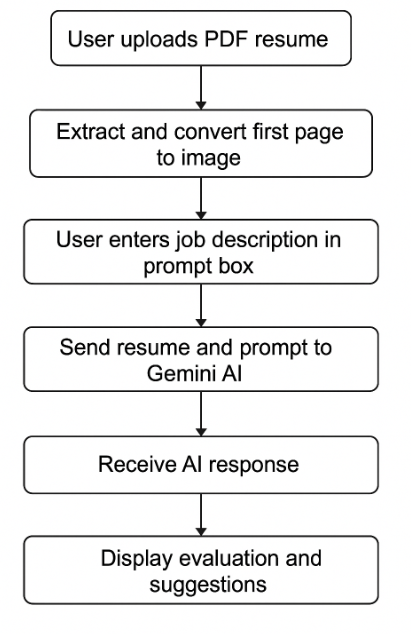
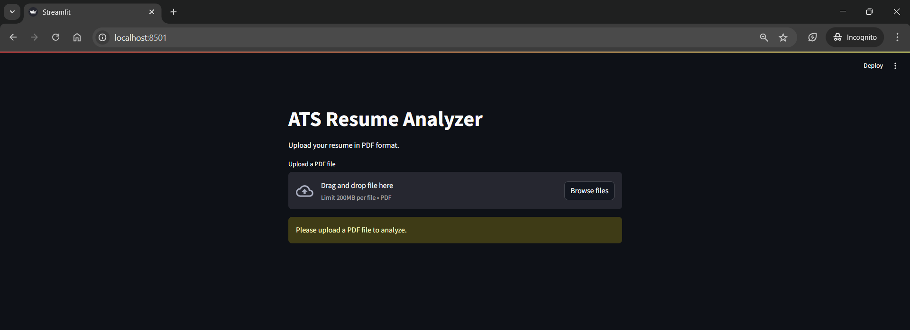
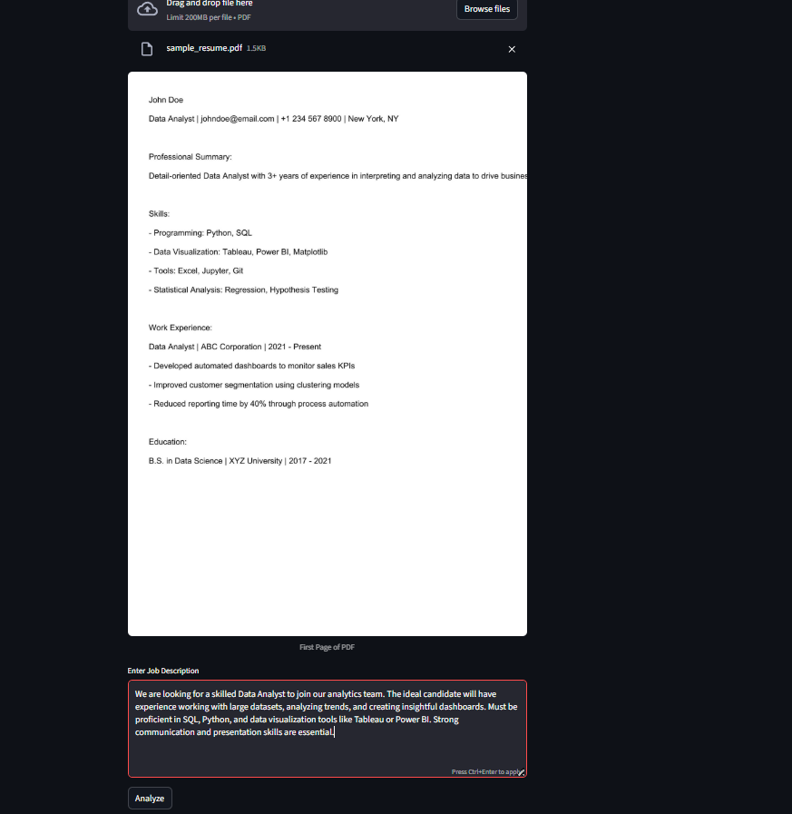
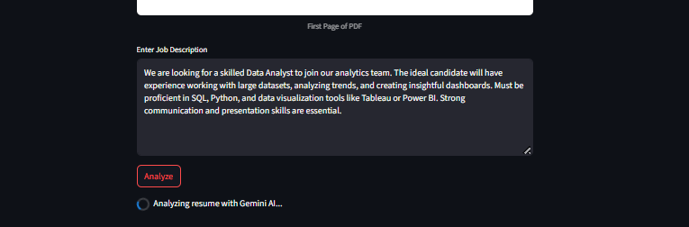
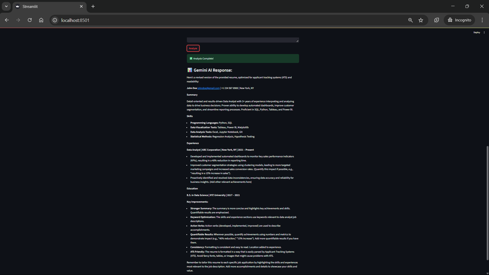

# 🧠 Gemini AI Resume Analyzer

An interactive Streamlit web application that leverages **Gemini AI** to analyze and match resumes against job descriptions. Tailored initially for **Data Analyst** roles, this tool helps job seekers and recruiters assess resume fit with instant feedback.

---

## 🚀 Features

- 📤 Upload your PDF resume.
- 🖼️ Automatically displays the first page of the uploaded PDF.
- 📝 Paste a job description into the prompt box.
- 🤖 Gemini AI evaluates your resume based on the job requirements.
- ✅ Instantly shows strengths, weaknesses, and suggestions.

---

## 📌 Technologies Used

- Python
- Streamlit
- Google Gemini AI API
- pdf2image
- Pillow
- dotenv
- Poppler (for PDF to image conversion)

---

## Screenshots

